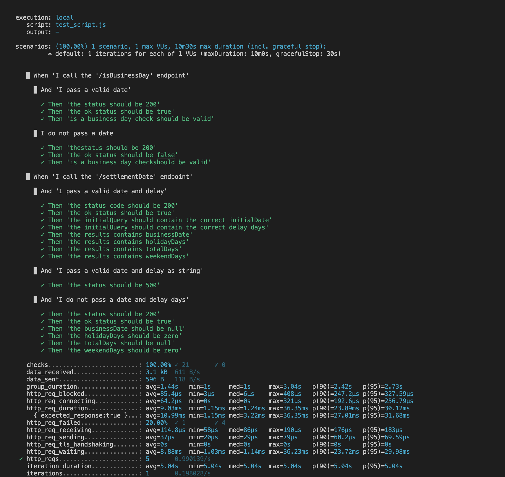
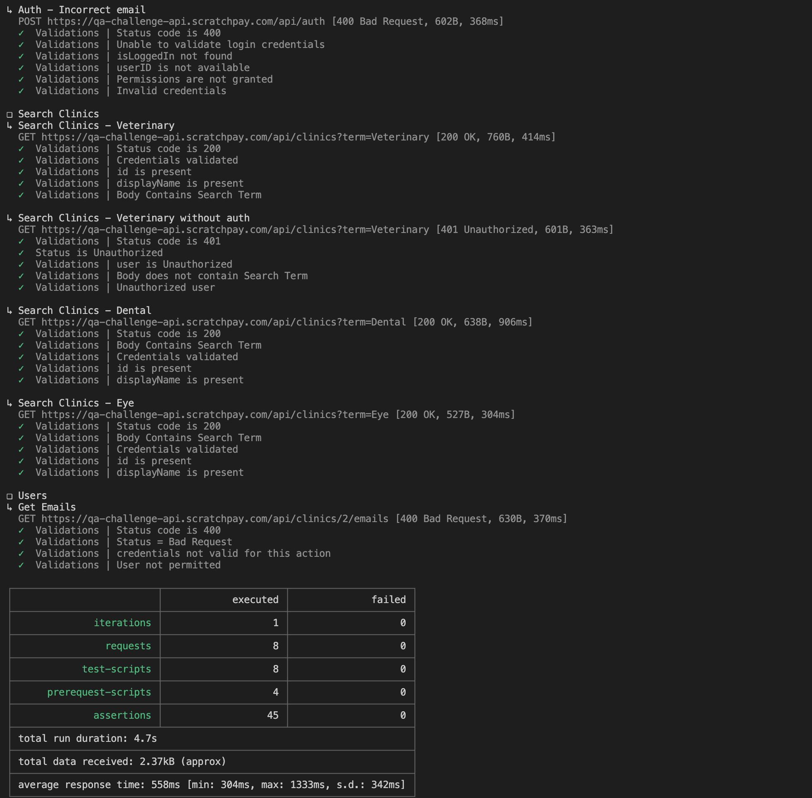

## QUESTION 1

I decided to use **K6** for this test. In addition to all the test cases covered, it can also be further scaled to cater for performance tests.
#### What is k6?
Grafana k6 is an open-source load testing tool that makes performance testing easy and productive for engineering teams. k6 is free, developer-centric, and extensible.

Using k6, you can test the reliability and performance of your systems and catch performance regressions and problems earlier. k6 will help you to build resilient and performant applications that scale. You can read more [here.](https://k6.io)

#### Running this code
```
// install k6
brew install k6

// update the baseURL. Check your exposed port and update the baseURL in the test_script.js file

// to run the script
cd question1
k6 run test_script.js

```

Here is what it looks like 


We can also update this test to run as a load test. 
One option is to run this 
```
// Running a 30-second, 10-VU load test
k6 run --vus 10 --duration 30s test_script.js
```

The other option is to add to the options constant
```
export const options = {
  vus: 10,
  duration: '30s',
  ...
};

// Then run the usual
k6 run test_script.js

```


## QUESTION 2

For the API Tests, a popular API testing tool - **Postman** is used here. To automate the process, Newman was used. It is a command-line Collection Runner for Postman. It enables you to run and test a Postman Collection directly from the command line. It's built with extensibility in mind so that you can integrate it with your continuous integration (CI) servers and build systems.

Running the code
```
cd question2

// Install dependencies
npm install

// run the test
npm run start 

// To export the test results to a json file:
npm run start-export
```

Here is what it looks like: 


## EXTRAS
- The CI/CD workflow using Github Actions are provided.